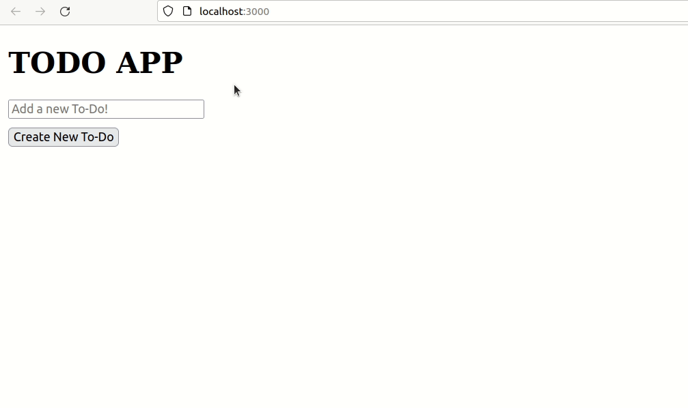

# To Do App

## Part 1: Getting Started

Welcome to the "To Do" app, which we will be using over the coming lessons to learn more about React!

For now, let's get a finished prototype of the app before we start to add extra functionality.

---

## Today's goal: 

Create a basic "to do" app prototype, which lets the user create and add "To Do" items.

**For a demo of how your prototype app could look, see the gif at the bottom of this file!**

---

### Features:

When creating your prototype app, you should try to use the following features:

- Split your UI up into **components** and use the "single responsibility principle", so that each component "only does one thing".
- Use **props** to pass information from parent components **down** to child components ("unidirectionally")
- Implement **state** using React's `useState` hook to manage: 
    - the "ToDo" the user is currently creating
    - the list of "ToDos" they already created.
- Make the "ToDo" `<input />` a controlled component. Like we saw earlier today, as the user changes the input, its value should be controlled by **state**.

Good luck, and have fun. :-)

